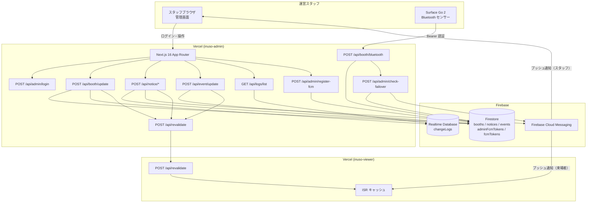
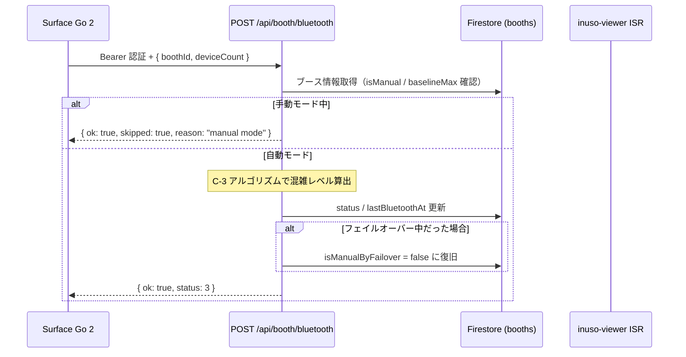
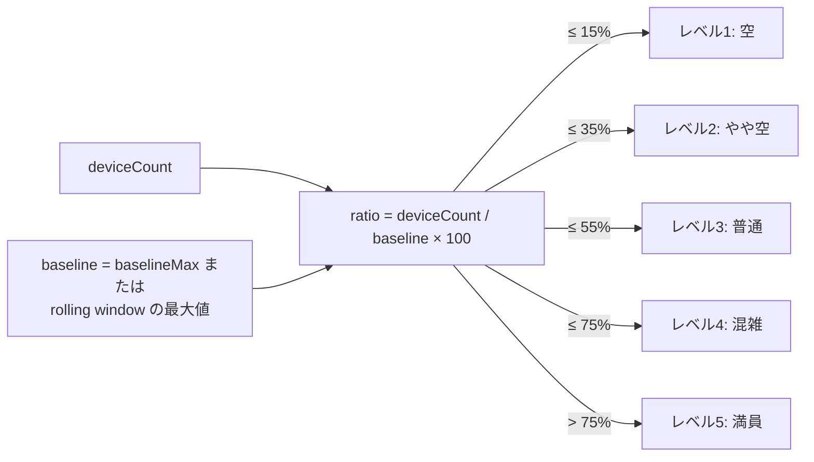
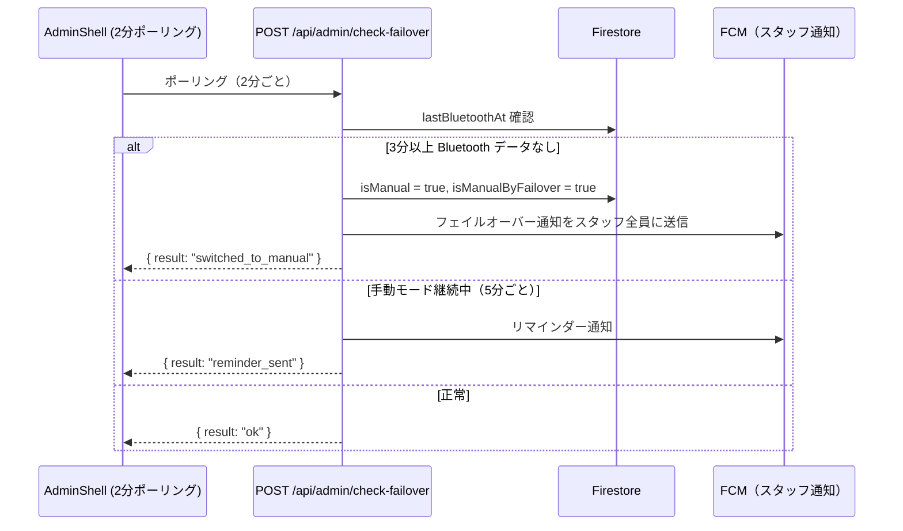
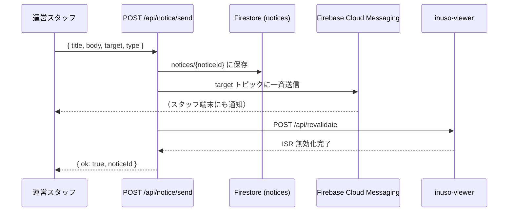

# システム構成・アーキテクチャ — inuso-admin

## 概要

inuso-admin は文化祭運営スタッフ向けの管理画面です。Bluetooth センサーからのデバイス数を受信して混雑レベルを算出し、Firestore へ保存します。更新後は inuso-viewer の ISR キャッシュを即時無効化します。

---

## システム全体構成図

---

## Bluetooth → 混雑レベル算出フロー

### C-3 混雑レベルアルゴリズム

- Rolling window: 直近 30 件のデバイス数を保持して最大値を baseline に使用
- `baselineMax` が設定済みの場合はそちらを優先

---

## フェイルオーバーフロー

---

## お知らせ送信フロー

---

## 主要コンポーネント

| レイヤー | 技術 | 役割 |
|---|---|---|
| フロントエンド | Next.js 16 App Router | 管理 UI |
| ホスティング | Vercel | サーバーレス API・エッジ配信 |
| 認証 | JWT Cookie (`admin_operator`) | スタッフ認証 |
| データベース | Firebase Firestore | ブース・お知らせ・イベント・FCM トークン |
| 変更ログ | Firebase Realtime Database | `changeLogs` |
| プッシュ通知 | Firebase Cloud Messaging (FCM) | 来場者・スタッフへの通知 |
| Bluetooth センサー | Surface Go 2 | デバイス数計測（Bearer 認証） |
| ステータス | Instatus | サービス稼働状況ページ |

## スコープ（アクセス権限）

| スコープ | 種別 | 権限 |
|---|---|---|
| `"実行委員"` | フルアクセス | 全ブース・全通知対象選択可 |
| `"教員"` | フルアクセス | 全ブース・全通知対象選択可 |
| `"1-1"` 〜 `"3-4"` | クラス担当 | 担当ブースのみ、通知は `all` のみ |
| `"eスポーツ部"` / `"美術部"` / `"有志発表"` | 部活担当 | 担当ブースのみ、通知は `all` のみ |
| `"キッチンカー"` / `"PTAバザー"` | 飲食担当 | 担当ブースのみ、通知は `all` のみ |
| `"保健委員会"` | 委員会担当 | 担当ブースのみ、通知は `all` のみ |

## 機能 ON/OFF システム

Firestore `config` コレクションで viewer・admin の各機能を管理します。

| Firestore ドキュメント | 制御対象 |
|---|---|
| `config/viewer_features` | inuso-viewer の各機能（service/event/booth/busy/eat/notice/digital/map） |
| `config/admin_features` | inuso-admin の各機能（service/notice/booth/event/eat） |
| `config/admin_accounts` | 運営オペレーターアカウントの有効/無効 |

- DB管理者画面 `/db/features` からトグルスイッチで制御
- フラグ変更時に `revalidateViewer()` で ISR キャッシュを即時更新
- `viewer_features.service: false` → viewer 全ページがメンテナンス画面に切替
